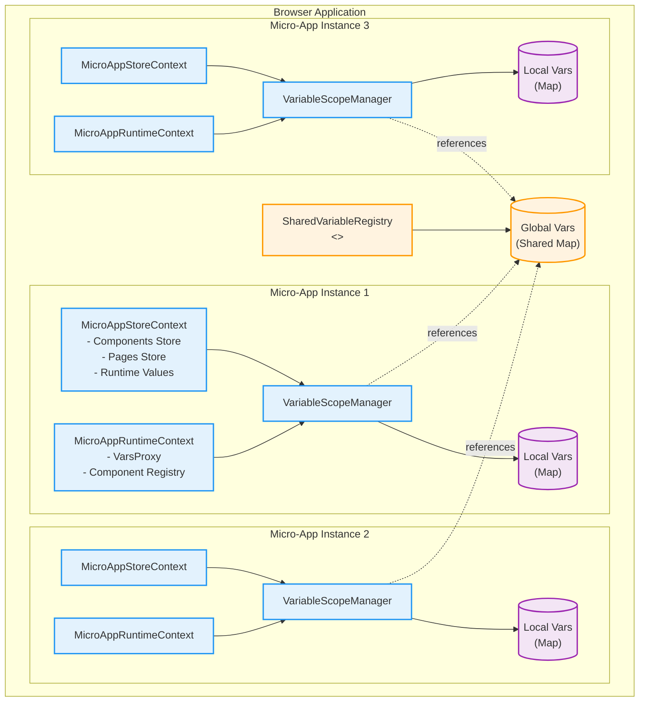
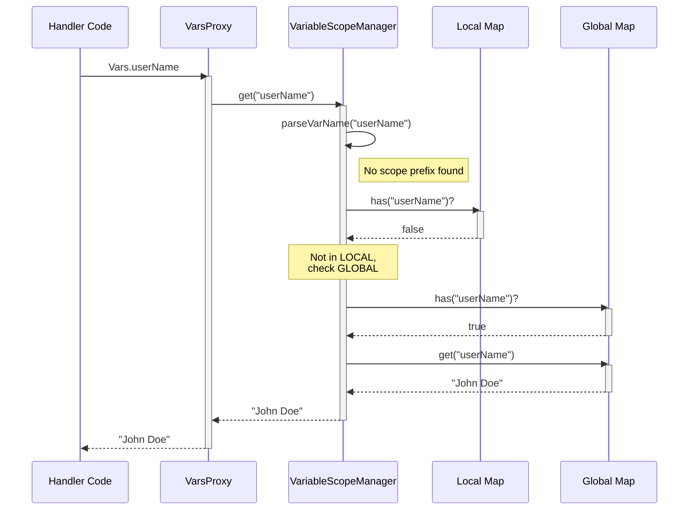
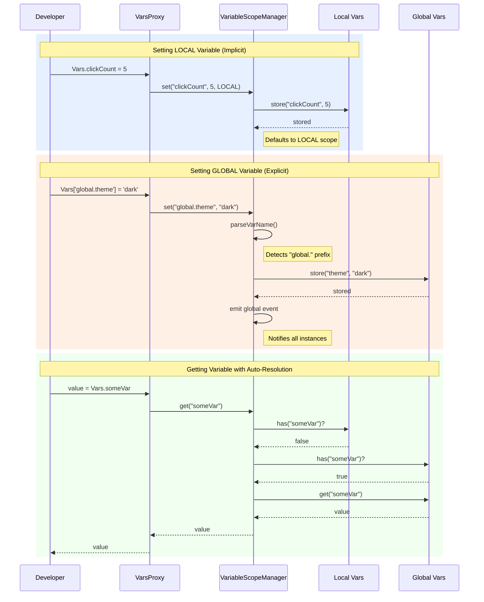
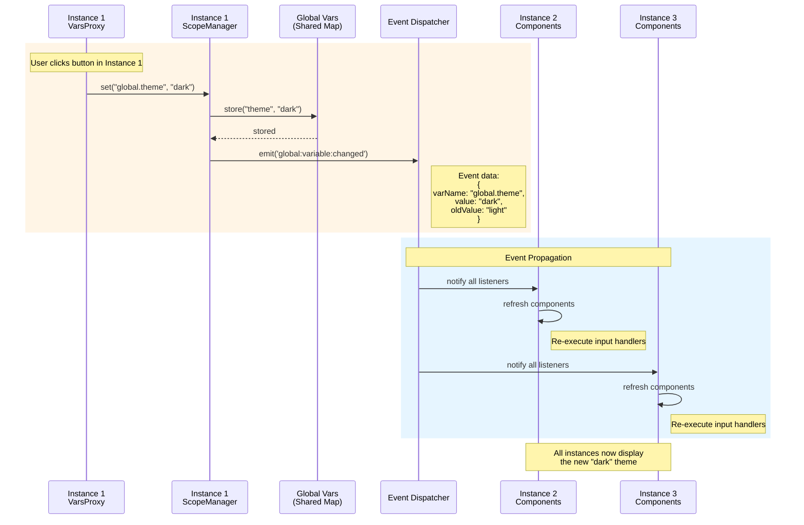
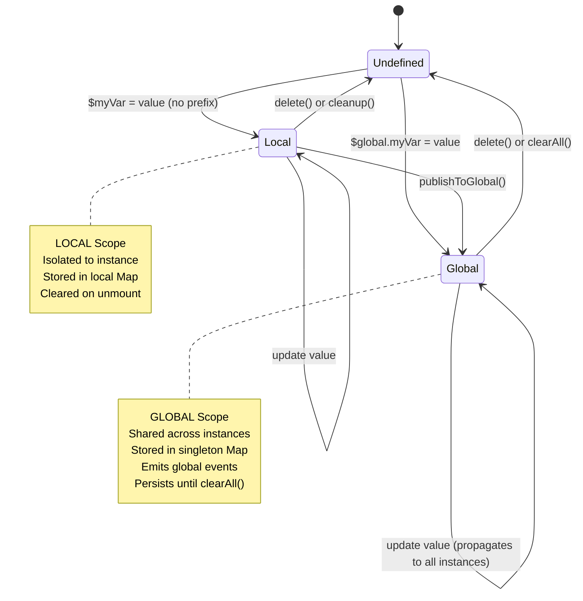
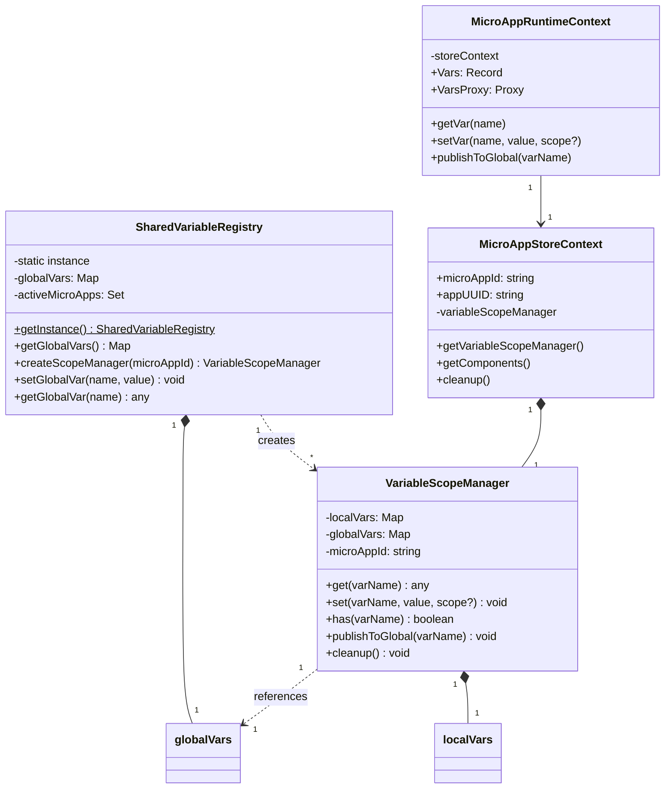
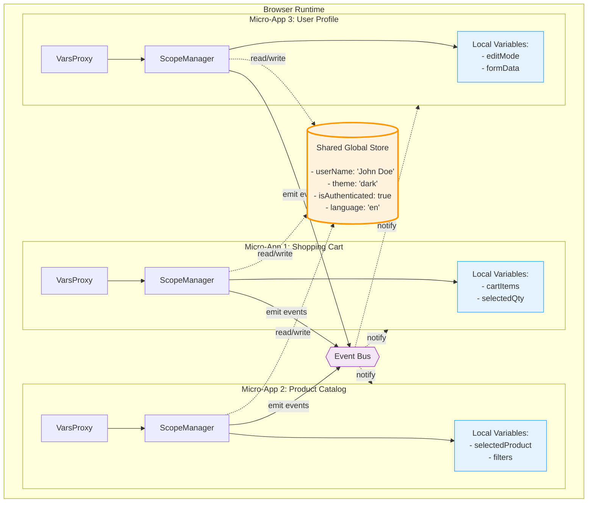

# Variable Scope System

The Nuraly micro-app architecture implements a **two-tier variable scope system** that provides flexible state management across different levels of isolation and sharing.

## Overview

Variables in micro-apps can exist at two different scope levels:

| Scope | Storage Level | Sharing Behavior | Use Cases |
|-------|--------------|------------------|-----------|
| **LOCAL** | Per micro-app instance | Isolated - each instance has its own storage | Temporary UI state, form inputs, component-specific data |
| **GLOBAL** | Singleton across all apps | Shared across ALL instances regardless of app | Authentication status, theme, language settings |

---

## Architecture Overview



:::info Key Points
- **LOCAL Scope**: Isolated per instance, cleared on unmount, default for all variables
- **GLOBAL Scope**: Shared across ALL instances, persists for session, triggers global events
- **Singleton Pattern**: One `SharedVariableRegistry` instance for entire application
:::

---

## Scope Resolution Flow

When you access a variable without an explicit scope prefix, the system automatically resolves it:



**Resolution Order**: `LOCAL` → `GLOBAL` → `undefined`

---

## Variable Access Patterns

### Setting LOCAL Variables

```javascript
// Implicit - defaults to LOCAL
$clickCount = 5
$tempData = { foo: 'bar' }

// Explicit
$local.formData = { name: '', email: '' }
```

### Setting GLOBAL Variables

```javascript
// Must use explicit prefix
$global.theme = 'dark'
$global.userName = 'John Doe'
$global.isAuthenticated = true
```

### Getting Variables

```javascript
// Auto-resolution (searches LOCAL → GLOBAL)
const userName = $userName

// Explicit scope access
const theme = $global.theme  // Only checks GLOBAL
const temp = $local.tempData  // Only checks LOCAL
```

---

## Complete Access Pattern Flow



---

## Global Variable Event Propagation

When a GLOBAL variable changes, the event propagates to **all** micro-app instances:



---

## Variable Lifecycle



---

## Class Structure



---

## Runtime Deployment

This diagram shows how the system works in practice with real applications:



---

## API Reference

### Publishing to Global Scope

You can promote a LOCAL variable to GLOBAL scope:

```javascript
// Start with local variable
$selectedProduct = { id: 123, name: 'Widget' }

// Publish to global scope
Runtime.publishToGlobal('selectedProduct')

// Now accessible globally
console.log($global.selectedProduct)
```

### Subscribing to Variable Changes

```javascript
// Subscribe to variable changes
const unsubscribe = Runtime.subscribeToVar('global.theme', (newTheme) => {
  console.log('Theme changed to:', newTheme)
  updateUITheme(newTheme)
})

// Cleanup when done
unsubscribe()
```

---

## Best Practices

:::tip Guidelines

1. **Use LOCAL by default** - Keep variables private unless needed elsewhere
2. **Use GLOBAL sparingly** - Only for truly global state (auth, theme, etc.)
3. **Explicit prefixes** - Use `$global.` prefix for clarity when setting globals
4. **Subscribe carefully** - Always unsubscribe to prevent memory leaks
5. **Avoid large objects** - GLOBAL variable changes trigger updates in ALL instances
6. ⚠️ **Not a security boundary** - All micro-apps run in same JavaScript context

:::

---

## Performance Considerations

- **GLOBAL variables trigger updates in ALL instances** - use judiciously
- **LOCAL variables are most performant** - updates don't propagate
- **Smart Caching** - Proxies cached using WeakMap for automatic garbage collection
- **Efficient Events** - Only affected components refresh on variable changes

---

## Common Patterns

### Pattern 1: Component-Specific State

```javascript
// Good - Uses LOCAL scope by default
$isLoading = true
$errorMessage = null
$formData = { name: '', email: '' }
```

### Pattern 2: Application-Wide State

```javascript
// Good - Explicit GLOBAL for shared state
$global.theme = 'dark'
$global.userName = currentUser.name
$global.isAuthenticated = true
```

### Pattern 3: Conditional Publishing

```javascript
// Start local, publish when needed
$draftArticle = { title: '', content: '' }

// User clicks "Share with team"
Runtime.publishToGlobal('draftArticle')
```

---

## Next Steps

- Learn about [Micro-App Architecture](./)
- Explore Component Communication (coming soon)
- See Handler Execution (coming soon)

---

## Related Resources

- [Variable Scope Manager Source](https://github.com/Nuralyio/stack/blob/main/services/studio/src/features/micro-app/state/VariableScopeManager.ts)
- [Shared Variable Registry Source](https://github.com/Nuralyio/stack/blob/main/services/studio/src/features/micro-app/state/SharedVariableRegistry.ts)
- [Runtime Context Source](https://github.com/Nuralyio/stack/blob/main/services/studio/src/features/micro-app/state/MicroAppRuntimeContext.ts)
