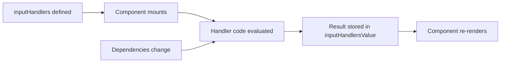
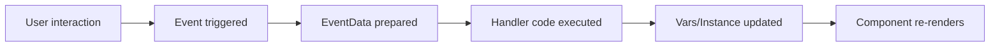

# TextInput Component

The **TextInput** component is a versatile input field for capturing and displaying text from users. It supports various input types, validation, and rich event handling.

## Overview

TextInput provides a complete text input solution with:
- Multiple input types (text, email, password, number, etc.)
- Built-in validation
- Copy/clear functionality
- Character counting
- Placeholder and helper text
- Disabled and readonly states
- Comprehensive event system

## Basic Usage

```typescript
{
  uuid: "my-text-input",
  name: "username_input",
  component_type: ComponentType.TextInput,
  input: {
    value: { type: "string", value: "default text" },
    placeholder: { type: "string", value: "Enter username" },
    label: { type: "string", value: "Username" }
  },
  event: {
    onChange: `
      console.log('Input value:', EventData.value);
    `
  }
}
```

## Component Properties

| Property | Type | Description |
|----------|------|-------------|
| `value` | string | Current input value |
| `placeholder` | string | Placeholder text when empty |
| `label` | string | Label text displayed above input |
| `type` | string | Input type (text, email, password, etc.) |
| `size` | string | Input size: 'small', 'medium', 'large' |
| `disabled` | boolean | Disable input interaction |
| `readonly` | boolean | Make input read-only |
| `required` | boolean | Mark as required |

---

## Input Handlers Reference

Input handlers in TextInput allow dynamic evaluation of properties. They are evaluated in real-time and update the component accordingly.

### Handler Evaluation Flow



### value
**Type:** `string | handler`

The current value of the input field.

**Dynamic Example:**
```typescript
input: {
  value: {
    type: "handler",
    value: `
      // Load user's saved preference
      const user = Vars.currentUser;
      return user?.preferences?.textInput?.lastValue || "";
    `
  }
}
```

**Static Example:**
```typescript
input: {
  value: { type: "string", value: "Initial text" }
}
```

### placeholder
**Type:** `string | handler`

Placeholder text displayed when input is empty.

**Dynamic Example:**
```typescript
input: {
  placeholder: {
    type: "handler",
    value: `
      return Vars.appSettings?.placeholders?.textInput || "Enter text...";
    `
  }
}
```

### label
**Type:** `string | handler`

Label text displayed above the input.

**Dynamic Example:**
```typescript
input: {
  label: {
    type: "handler",
    value: `
      return Vars.isRequired ? "Username *" : "Username";
    `
  }
}
```

### type
**Type:** `string`

Input type attribute. Common values: `text`, `email`, `password`, `number`, `tel`, `url`.

```typescript
input: {
  type: { type: "string", value: "email" }
}
```

### size
**Type:** `string`

Input size: `small`, `medium`, `large`.

```typescript
input: {
  size: { type: "string", value: "medium" }
}
```

### disabled
**Type:** `boolean | handler`

Whether input is disabled.

**Dynamic Example:**
```typescript
input: {
  disabled: {
    type: "handler",
    value: `
      return Vars.isProcessing || Vars.formSubmitted;
    `
  }
}
```

### readonly
**Type:** `boolean`

Make input read-only (can select but not edit).

```typescript
input: {
  readonly: { type: "boolean", value: false }
}
```

### required
**Type:** `boolean`

Mark field as required for validation.

```typescript
input: {
  required: { type: "boolean", value: true }
}
```

### helper
**Type:** `string | handler`

Helper text displayed below input.

**Dynamic Example:**
```typescript
input: {
  helper: {
    type: "handler",
    value: `
      if (Vars.showValidation && !Vars.emailValid) {
        return "Please enter a valid email address";
      }
      return "We'll never share your email";
    `
  }
}
```

### maxLength
**Type:** `number`

Maximum character length.

```typescript
input: {
  maxLength: { type: "number", value: 100 }
}
```

### showCount
**Type:** `boolean`

Display character count when maxLength is set.

```typescript
input: {
  showCount: { type: "boolean", value: true },
  maxLength: { type: "number", value: 100 }
}
```

### allowClear
**Type:** `boolean`

Show clear button to quickly empty the field.

```typescript
input: {
  allowClear: { type: "boolean", value: true }
}
```

### withCopy
**Type:** `boolean`

Show copy button to copy value to clipboard.

```typescript
input: {
  withCopy: { type: "boolean", value: true }
}
```

### Validation Handlers
**Type:** `boolean`

Control when validation occurs.

```typescript
input: {
  validateOnChange: { type: "boolean", value: true },
  validateOnBlur: { type: "boolean", value: true },
  hasFeedback: { type: "boolean", value: true }
}
```

### rules
**Type:** `array`

Validation rules.

```typescript
input: {
  rules: {
    type: "array",
    value: [
      { required: true, message: "Username is required" },
      { min: 3, message: "Minimum 3 characters" },
      { pattern: /^[a-zA-Z0-9_]+$/, message: "Only alphanumeric and underscore allowed" }
    ]
  }
}
```

### min / max / step
**Type:** `number`

For number type inputs.

```typescript
input: {
  type: { type: "string", value: "number" },
  min: { type: "number", value: 0 },
  max: { type: "number", value: 100 },
  step: { type: "number", value: 5 }
}
```

### autocomplete
**Type:** `string`

HTML autocomplete attribute value.

```typescript
input: {
  autocomplete: { type: "string", value: "email" }
}
```

### Handler Execution Context

When a handler is evaluated, you have access to:

```typescript
// Access variables
Vars.username = "John"

// Access current component
Current.name       // Component name
Current.uuid       // Component ID
Current.Instance   // Component runtime values

// Access microapp context (if in microapp)
// Local scope (default)
Vars.localVar = value

// Global scope (shared)
Vars['global.theme'] = 'dark'
```

### Microapp Input Handler Isolation

In microapps, input handler evaluation is scoped:

- **Local variables** are isolated to the microapp instance
- **Global variables** are shared across all instances
- Handlers have access to the microapp's isolated runtime only

---

## Events Reference

Events in TextInput allow you to respond to user interactions. Each event receives `EventData` containing relevant information about the interaction.

### Event Execution Flow



### onChange
**Triggered:** When input value changes

**EventData:**
```typescript
{
  value: string      // New value
  oldValue: string   // Previous value
  event: Event       // Native event
}
```

**Example:**
```typescript
event: {
  onChange: `
    Vars.username = EventData.value;
    
    // Validate
    if (EventData.value.length < 3) {
      Vars.usernameError = "Minimum 3 characters";
    } else {
      Vars.usernameError = "";
    }
  `
}
```

### onFocus
**Triggered:** When input receives focus

**EventData:**
```typescript
{
  value: string      // Current value
  event: Event       // Native event
}
```

**Example:**
```typescript
event: {
  onFocus: `
    Vars.activeField = "username";
    Vars.helpTextVisible = true;
  `
}
```

### onBlur
**Triggered:** When input loses focus

**EventData:**
```typescript
{
  value: string      // Final value
  event: Event       // Native event
}
```

**Example:**
```typescript
event: {
  onBlur: `
    Vars.activeField = null;
    
    // Perform final validation
    const isValid = EventData.value.length >= 3;
    Vars.showValidation = true;
    Vars.usernameValid = isValid;
  `
}
```

### onEnter
**Triggered:** When Enter key is pressed

**EventData:**
```typescript
{
  value: string      // Current value
  event: Event       // Keyboard event
}
```

**Example:**
```typescript
event: {
  onEnter: `
    // Submit form on Enter
    if (Vars.usernameValid) {
      SubmitForm();
    }
  `
}
```

### onClear
**Triggered:** When clear button is clicked (if `allowClear` is true)

**EventData:**
```typescript
{
  value: string      // Should be empty
  event: Event       // Click event
}
```

**Example:**
```typescript
event: {
  onClear: `
    Vars.username = "";
    Vars.usernameError = "";
    Vars.showValidation = false;
  `
}
```

### onArrowUp / onArrowDown
**Triggered:** When arrow keys are pressed (useful for number inputs or autocomplete)

**EventData:**
```typescript
{
  event: KeyboardEvent  // Keyboard event
}
```

**Example:**
```typescript
event: {
  onArrowUp: `
    if (Current.input?.type?.value === "number") {
      const current = parseInt(EventData.event.target.value) || 0;
      EventData.event.target.value = current + 1;
    }
  `
}
```

---

## Common Event Patterns

### Form Submission Handler
```typescript
event: {
  onEnter: `
    const email = EventData.value;
    
    // Validate
    const isValid = /^[^\s@]+@[^\s@]+\.[^\s@]+$/.test(email);
    if (!isValid) {
      Vars.error = "Invalid email";
      return;
    }
    
    // Submit
    const result = await SubmitEmail(email);
    Vars.success = result.success;
  `
}
```

### Real-time Search
```typescript
event: {
  onChange: `
    const query = EventData.value;
    Vars.searchQuery = query;
    
    if (query.length >= 2) {
      const results = await SearchAPI(query);
      Vars.searchResults = results;
    } else {
      Vars.searchResults = [];
    }
  `
}
```

### Dependent Field Updates
```typescript
event: {
  onChange: `
    const country = EventData.value;
    Vars.selectedCountry = country;
    
    // Update related field
    const cities = Vars.citiesByCountry[country] || [];
    Vars.availableCities = cities;
    Vars.selectedCity = ""; // Reset city selection
  `
}
```

### Character Limit Enforcement
```typescript
event: {
  onChange: `
    const maxChars = 100;
    let value = EventData.value;
    
    if (value.length > maxChars) {
      value = value.substring(0, maxChars);
      Current.Instance.value = value;  // Update component
    }
    
    Vars.charCount = value.length;
    Vars.charsRemaining = maxChars - value.length;
  `
}
```

### EventData Structure Reference

All TextInput events provide EventData object:

```typescript
EventData = {
  value?: string              // New/current value
  oldValue?: string           // Previous value (onChange only)
  event?: Event | KeyboardEvent // Native browser event
}
```

### Microapp Event Isolation

Events in microapps maintain isolation:

```typescript
// Local scope (microapp instance only)
Vars.username = EventData.value

// Global scope (shared across instances)
Vars['global.lastActivity'] = Date.now()

// Component-scoped state
Current.Instance.validationState = "pending"
```

When an event handler accesses `Vars`, it operates in the microapp's local scope by default. To access global variables, use the `global.` prefix.

### Async Event Handling

Event handlers support async operations:

```typescript
event: {
  onChange: `
    const value = EventData.value;
    
    // Start validation
    Vars.validating = true;
    
    try {
      const result = await ValidateUsername(value);
      Vars.isAvailable = result.available;
      Vars.validationError = result.error || "";
    } catch (err) {
      Vars.validationError = "Validation failed";
    } finally {
      Vars.validating = false;
    }
  `
}
```

---

## Styling

TextInput supports dynamic styling through `styleHandlers`:

```typescript
{
  styleHandlers: {
    width: `return Vars.isCompact ? '200px' : '100%';`,
    backgroundColor: `return Vars.theme === 'dark' ? '#333' : '#fff';`
  }
}
```

---

## Complete Example

Here's a complete TextInput example combining inputs, events, and styling:

```typescript
{
  uuid: "email-input",
  name: "email_field",
  component_type: ComponentType.TextInput,
  
  // Input handlers for dynamic properties
  input: {
    value: {
      type: "handler",
      value: `return Vars.email || "";`
    },
    label: {
      type: "handler",
      value: `return Vars.showValidation && !Vars.emailValid ? "Email *" : "Email";`
    },
    placeholder: {
      type: "string",
      value: "Enter your email"
    },
    type: { type: "string", value: "email" },
    required: { type: "boolean", value: true },
    helper: {
      type: "handler",
      value: `
        if (Vars.showValidation && !Vars.emailValid) {
          return "Please enter a valid email address";
        }
        return "We'll never share your email";
      `
    },
    disabled: {
      type: "handler",
      value: `return Vars.isSubmitting;`
    }
  },
  
  // Event handlers for user interactions
  event: {
    onChange: `
      Vars.email = EventData.value;
      
      // Real-time validation
      const isValid = /^[^\s@]+@[^\s@]+\.[^\s@]+$/.test(EventData.value);
      Vars.emailValid = isValid;
    `,
    
    onBlur: `
      Vars.showValidation = true;
    `,
    
    onEnter: `
      if (Vars.emailValid) {
        SubmitForm();
      }
    `
  },
  
  // Dynamic styling
  styleHandlers: {
    width: `return Vars.isCompact ? '200px' : '100%';`,
    borderColor: `
      if (Vars.showValidation && !Vars.emailValid) {
        return '#ff0000';
      }
      return '#ccc';
    `,
    opacity: `return Vars.isSubmitting ? '0.6' : '1';`
  }
}
```

---

## Microapp Integration

TextInput components in microapps maintain isolated state:

```typescript
// Local variable (microapp-scoped)
Vars.username = 'John'

// Global variable (shared across all instances)
Vars['global.theme'] = 'dark'
```

See [Variable Scopes](../architecture/micro-apps/variable-scopes.md) for details on local vs global scope in microapps.

---

## Source Code Reference

- **Component:** `src/shared/ui/components/inputs/TextInput/TextInput.ts`
- **Base Class:** `src/shared/ui/components/base/BaseElement.ts`
- **Runtime:** `src/features/runtime/state/runtime-context.ts`
| `disabled` | boolean | Disable input interaction |
| `readonly` | boolean | Make input read-only |
| `required` | boolean | Mark as required |

## Input Handlers & Events

### Available Input Handlers
See [TextInput Input Handlers](./text-input-inputs.md) for complete reference including:
- `value` - Dynamic value evaluation
- `placeholder` - Dynamic placeholder
- `label` - Dynamic label
- `disabled` - Dynamic disabled state
- And more...

### Available Events
See [TextInput Events](./text-input-events.md) for complete reference including:
- `onChange` - Triggered on value change
- `onFocus` - Triggered on focus
- `onBlur` - Triggered on blur
- `onEnter` - Triggered when Enter key pressed
- `onClear` - Triggered when clear button clicked
- And more...

## Common Examples

### Display User Input
```typescript
{
  input: {
    value: {
      type: "handler",
      value: `return Vars.username || '';`
    }
  }
}
```

### Handle Text Changes
```typescript
event: {
  onChange: `
    Vars.username = EventData.value;
    Vars.formDirty = true;
  `
}
```

### Validate Email Input
```typescript
{
  input: {
    type: { type: "string", value: "email" },
    rules: { 
      type: "array", 
      value: [{ required: true, message: "Email is required" }]
    }
  },
  event: {
    onChange: `
      const isValid = /^[^\s@]+@[^\s@]+\.[^\s@]+$/.test(EventData.value);
      Vars.emailValid = isValid;
    `
  }
}
```

## Styling

TextInput supports dynamic styling through `styleHandlers`:

```typescript
{
  styleHandlers: {
    width: `return Vars.isCompact ? '200px' : '100%';`,
    backgroundColor: `return Vars.theme === 'dark' ? '#333' : '#fff';`
  }
}
```

## Microapp Integration

TextInput components in microapps maintain isolated state:

```typescript
// Local variable (microapp-scoped)
Vars.username = 'John'

// Global variable (shared across all instances)
Vars['global.theme'] = 'dark'
```

Events in microapps are scoped to the instance. See [Variable Scopes](../architecture/micro-apps/variable-scopes.md) for details.

## See Also

- [TextInput Input Handlers](./text-input-inputs.md)
- [TextInput Events](./text-input-events.md)
- [Core Concepts](./core-concepts.md)
- [RuntimeContext](../architecture/index.md)
